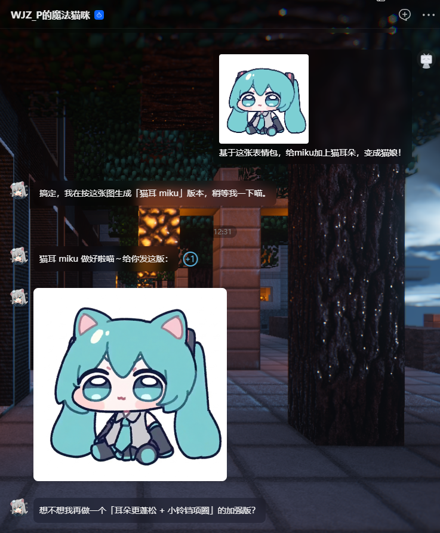

<!-- PROJECT SHIELDS -->

<div align="center">

  <a href="https://github.com/Lumiaqian/gemini-web-cli/graphs/contributors">
    
  </a>
  &nbsp;
  <a href="https://github.com/Lumiaqian/gemini-web-cli/network/members">
    
  </a>
  &nbsp;
  <a href="https://github.com/Lumiaqian/gemini-web-cli/stargazers">
    
  </a>
  &nbsp;
  <a href="https://github.com/Lumiaqian/gemini-web-cli/issues">
    
  </a>
  &nbsp;
  <a href="https://github.com/Lumiaqian/gemini-web-cli/blob/main/LICENSE">
    
  </a>

</div>

<br>

<!-- PROJECT LOGO -->

<p align="center">
  <a href="https://github.com/Lumiaqian/gemini-web-cli/">
    
  </a>
</p>

<h1 align="center">Gemini Web CLI</h1>

<p align="center">
  CLI-first Gemini web automation via CDP, machine-safe JSON output with build, test, and CI scripts.
  <br><br>
  <a href="#-usage">Quick Start</a>
  ·
  <a href="https://github.com/Lumiaqian/gemini-web-cli/issues">Report Bug</a>
  ·
  <a href="https://github.com/Lumiaqian/gemini-web-cli/issues">Request Feature</a>
</p>

<p align="center">
  English | <a href="./README.md">中文</a>
</p>

<br>

<p align="center">
  <a href="https://www.bilibili.com/video/BV1e54y1z7XM">
    
  </a>
</p>
<h2 align="center">

"Thorns peeled away, &nbsp; yet just as you once said,

The tenderness we clung to is but a blank page,

Cradling shattered dreams and the story we made."

</h2>

## Table of Contents

- [Features](#-features)
- [Architecture](#️-architecture)
- [Installation](#-installation)
- [Configuration](#️-configuration)
- [Usage](#-usage)
- [CLI Command Mapping](#-cli-command-mapping)
- [Daemon Lifecycle](#-daemon-lifecycle)
- [Project Structure](#-project-structure)
- [Notes](#️-notes)
- [To Do List](#-to-do-list)
- [License](#-license)

<br>

<p align="center">
  
</p>

<p align="center"><em>▲ Auto-generate sticker images through AI conversation</em></p>

<br>

## ✨ Features

|  | Feature | Description |
|:---:|---------|-------------|
| 🎨 | **AI Image Generation** | Send prompts to generate images, with full-size high-resolution download support |
| 💬 | **Text Conversations** | Run multi-turn conversations with Gemini in the browser |
| 🖼️ | **Image Upload** | Upload reference images for image-to-image workflows |
| 📥 | **Image Extraction** | Extract generated images through base64 export or full-size CDP download |
| 🔄 | **Session Management** | Start new chats, open temporary chats, switch models, and navigate to saved sessions |
| 🧹 | **Auto Watermark Removal** | Strip the Gemini watermark from downloaded images automatically |
| 🧰 | **CLI-first Automation** | Use `node scripts/run-cli.mjs` or `npm run cli --` for scripts, local automation, and CI with machine-safe `--json` output |

<br>

## 🏗️ Architecture

```
┌─────────────────────────────────────────────────────┐
│          CLI Caller / Script / CI Runner            │
│      node scripts/run-cli.mjs ... --json            │
└──────────────────────┬──────────────────────────────┘
                       │ JSON envelope + exit codes
                       ▼
┌─────────────────────────────────────────────────────┐
│   native-cli/hybrid-native-cli-node-core shell      │
│  command tree, runtime guards, machine contract     │
└──────────────────────┬──────────────────────────────┘
                       │
                       ▼
┌─────────────────────────────────────────────────────┐
│           index.js → browser.js (Connection Layer)  │
│   ensureBrowser() → auto-start Daemon → CDP link    │
└──────────┬──────────────────────────────┬───────────┘
           │ HTTP (acquire/status)        │ WebSocket (CDP)
           ▼                              ▼
┌──────────────────────┐    ┌─────────────────────────┐
│   Browser Daemon     │    │     Chrome / Edge        │
│  (standalone process)│───▶│   gemini.google.com     │
│  daemon/server.js    │    │                         │
│  ├─ engine.js        │    │  Stealth + anti-detect   │
│  ├─ handlers.js      │    └─────────────────────────┘
│  └─ lifecycle.js     │
│     30-min idle TTL  │
└──────────────────────┘
```

**Core Design Principles:**

- **CLI-first product surface**: The supported primary entrypoint is `node scripts/run-cli.mjs`.
- **Daemon mode**: The browser process is managed by a standalone daemon. After a CLI command finishes, the browser stays alive and closes only after 30 minutes of inactivity.
- **On-demand auto-start**: If the daemon is not running, CLI commands can spawn it automatically. Manual startup is optional.
- **Stealth anti-detect**: Uses `puppeteer-extra-plugin-stealth` to reduce bot detection.
- **Separation of concerns**: CLI shell and runtime live in `native-cli/`, browser session logic lives in `src/`, and process lifecycle control lives in `src/daemon/`.

<br>

## 📦 Installation

### Prerequisites

- **Node.js** 18 or later
- **Chrome, Edge, or Chromium** installed locally, or a custom browser path via `BROWSER_PATH`
- Access to `gemini.google.com`
- A Google account already signed in through the target browser profile

### Install via npm (recommended)

```bash
npm install -g gemini-web-cli
```

After installation, the `gemini-web-cli` command is available globally.

### Install from source

```bash
git clone https://github.com/Lumiaqian/gemini-web-cli.git
cd gemini-web-cli
npm install
```

<br>

## ⚙️ Configuration

All configuration is done through environment variables or a `.env` file in the project root.

```env
# Browser executable path. If unset, Chrome, Edge, or Chromium is auto-detected.
# BROWSER_PATH=/Applications/Google Chrome.app/Contents/MacOS/Google Chrome

# CDP remote debugging port (default: 40821)
# BROWSER_DEBUG_PORT=40821

# Headless mode (default: false, keep it off for first-time login)
# BROWSER_HEADLESS=false

# Image output directory (default: ./gemini-image)
# OUTPUT_DIR=./gemini-image

# Daemon HTTP port (default: 40225)
# DAEMON_PORT=40225

# Daemon idle timeout in milliseconds (default: 30 minutes)
# DAEMON_TTL_MS=1800000
```

`.env.development` is also supported and takes priority over `.env`.

**Priority order:** `process.env` > `.env.development` > `.env` > code defaults

<br>

## 🚀 Usage

### Quick Start

```bash
npm run cli -- --help
npm run cli -- --version
npm run cli -- describe-scaffold --json
npm run cli -- diagnostic browser-info --json
```

In machine mode, stdout contains a single JSON envelope and diagnostics go to stderr.

### Real CLI commands

```bash
npm run cli -- conversation send-message --message "Hello" --json
npm run cli -- image generate-image --prompt "A ginger cat wearing headphones" --timeout-ms 180000 --json
npm run cli -- text get-latest-text-response --json
```

### Build the local CLI artifact

```bash
npm run build
node dist/native-cli/hybrid-native-cli-node-core/run-dev.mjs describe-scaffold --json
```

### Run the verification scripts

```bash
npm run test
npm run test:contract
npm run test:integration
npm run test:smoke
npm run ci
```

### Validate the local release dry run

```bash
npm run release:dry-run
```

### Start the daemon manually

```bash
npm run daemon
```

### Library-level usage

```javascript
import { createGeminiSession, disconnect } from './src/index.js';

const { ops } = await createGeminiSession();

const result = await ops.generateImage('Draw a cute cat', { fullSize: true });
console.log('Image saved to:', result.filePath);

disconnect();
```

<br>

## 🧭 CLI Command Mapping

### Image Generation

| CLI Command | Description |
|-------------|-------------|
| `image generate-image` | Full image generation pipeline, usually takes 60 to 120 seconds |

### Session Management

| CLI Command | Description |
|-------------|-------------|
| `session new-chat` | Start a new blank conversation |
| `session temp-chat` | Enter temporary chat mode without saving history |
| `session navigate-to` | Open a specific Gemini URL, such as a saved session |

### Model and Conversation

| CLI Command | Description |
|-------------|-------------|
| `model switch-model` | Switch to a target Gemini model |
| `conversation send-message` | Send text and wait for a reply |

### Image Operations

| CLI Command | Description |
|-------------|-------------|
| `image upload-images` | Upload local images into the current prompt input |
| `image get-images` | List image metadata from the current session |
| `image extract-image` | Extract image base64 data and save it locally |
| `image download-full-size-image` | Download the full-size high-resolution image |

### Text Responses

| CLI Command | Description |
|-------------|-------------|
| `text get-all-text-responses` | Return all text responses in the current session |
| `text get-latest-text-response` | Return the latest text response |

### Diagnostics and Management

| CLI Command | Description |
|-------------|-------------|
| `diagnostic check-login` | Check whether the browser is logged into Google |
| `diagnostic probe` | Probe page element state for debugging |
| `diagnostic reload-page` | Reload the current Gemini page |
| `diagnostic browser-info` | Show browser connection details |

<br>

## 🔄 Daemon Lifecycle

```
First CLI command
  │
  ├─ Daemon not running → auto-spawn (detached + unref)
  │                        → poll until ready (up to 15s)
  │
  ├─ GET /browser/acquire → launch or reuse browser + reset 30-minute countdown
  │
  ├─ CLI command finishes → disconnect() closes WebSocket, browser stays alive
  │
  ├─ Another call within 30 minutes → countdown resets and extends TTL
  │
  └─ 30 minutes with no activity → close browser + stop HTTP server + exit process
                                 (next call auto-respawns the daemon)
```

**Daemon API endpoints:**

| Endpoint | Description |
|----------|-------------|
| `GET /browser/acquire` | Acquire a browser connection and reset the TTL |
| `GET /browser/status` | Query browser status without resetting the TTL |
| `POST /browser/release` | Manually destroy the browser |
| `GET /health` | Run a daemon health check |

<br>

## 📁 Project Structure

```
gemini-web-cli/
├── src/
│   ├── index.js               # Unified library entry point
│   ├── browser.js             # Browser connector and daemon integration
│   ├── gemini-ops.js          # Gemini page operations
│   ├── operator.js            # Low-level DOM operation helpers
│   ├── config.js              # Centralized configuration
│   ├── util.js                # Shared utility helpers
│   ├── watermark-remover.js   # Image watermark removal via sharp
│   ├── assets/                # Static assets
│   └── daemon/                # Browser daemon process
│       ├── server.js          # HTTP service entry
│       ├── engine.js          # Browser launch and reuse engine
│       ├── handlers.js        # API route handlers
│       └── lifecycle.js       # Idle TTL and shutdown control
├── scripts/
│   ├── run-cli.mjs            # Primary CLI entry
│   ├── build-cli.mjs          # Local build pipeline
│   ├── test-unit.mjs          # Unit test runner
│   ├── test-contract.mjs      # Contract test runner
│   ├── test-integration.mjs   # Integration test runner
│   ├── run-smoke.mjs          # Smoke test runner
│   ├── ci-local.mjs           # Local CI entry
│   └── release-dry-run.mjs    # Release dry-run workflow
├── native-cli/
│   └── hybrid-native-cli-node-core/
│       ├── src/               # CLI shell and route implementation
│       └── test/              # Route-local tests
├── markdown/                  # README assets
├── references/                # Reference documentation
├── package.json
├── README.en.md
├── README.md
└── LICENSE
```

<br>

## ⚠️ Notes

1. **First-time login is required**: On the first real run, the browser opens Gemini and you must complete Google account login manually. The login state is stored in the browser profile, so later runs usually do not require another sign-in.

2. **Use one browser instance per CDP port**: Only one browser process should own the configured debugging port at a time.

3. **Windows Server users should double-check the environment**:
   - Chrome or Edge is installed correctly
   - The output directory is writable
   - Localhost traffic is not blocked by the firewall

4. **Image generation takes time**: Expect 60 to 120 seconds in common cases. Use a timeout budget of at least `180000` when needed.

5. **JSON mode is the stable automation contract**: For scripts and CI, prefer `--json` so stdout stays machine-safe.

<br>

## 📝 To Do List

- [x] **CLI command surface**
- [x] **On-demand daemon auto-start**
- [x] **Full-size CDP image download**
- [x] **Auto watermark removal**
- [x] **Reference image upload and image-to-image support**
- [x] **Historical session navigation**
- [ ] **Multi-browser parallel support**
- [ ] **Music generation support**
- [ ] **Video generation support**

<br>

## 🙏 Acknowledgments

This project is based on [WJZ-P/gemini-skill](https://github.com/WJZ-P/gemini-skill). Huge thanks to the original author for building the core Gemini web automation capabilities — CDP-driven browser control, session management, image generation and extraction, watermark removal, and more. This project strips out MCP-related code and restructures it as a pure CLI tool.

## 📄 License

This project is licensed under the MIT License. See [LICENSE](https://github.com/Lumiaqian/gemini-web-cli/blob/main/LICENSE) for details.

## LINUX DO

This project supports the [LINUX DO](https://linux.do) community.

<br>

## If you find this useful, give it a ⭐!

## ⭐ Star History

[](https://starchart.cc/Lumiaqian/gemini-web-cli)
